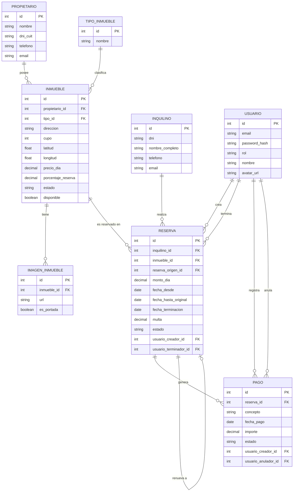

# Inmobiliaria MVC

> Sitio web desarrollado en ASP.NET MVC para la gestión de alquileres temporarios de propiedades inmuebles de una agencia inmobiliaria.

Repositorio: https://github.com/hernanf5/inmobiliariaFUNES

---

## Integrante del Grupo

* **Hernan Funes** - *funes.hernan.max@gmail.com* - [@hernanf5](https://github.com/hernanf5) - Discord: `hernanfunes`

---

## Estado del proyecto

**Primera entrega**: ABM (Alta, Baja y Modificación) de Propietarios e Inquilinos.

---

## Modelado de Datos

A continuación se presenta el esquema del modelo de datos correspondiente a la aplicación:

### Diagrama Entidad-Relación (DER)

<details>
<summary>Ver diagrama en código Mermaid</summary>



</details>

> El diagrama completo modela todo el dominio del proyecto (propietarios, inmuebles, reservas, pagos y usuarios). Para esta primera entrega, la funcionalidad implementada abarca únicamente el ABM de **Propietario** e **Inquilino**; el resto de las entidades ya están contempladas en el script de base de datos para sostener las próximas entregas.

---

## Base de Datos

### Motor utilizado

MySQL 8, corriendo en un contenedor Docker. La administración se realiza con **DBeaver**.

### Estructura del script

El script se encuentra en [`database/InmobiliariaDB.sql`](./database/InmobiliariaDB.sql) e incluye:

* Creación de la base de datos `InmobiliariaDB`.
* Creación de todas las tablas del modelo (Propietario, Inquilino, Inmueble, TipoInmueble, ImagenInmueble, Reserva, Pago, Usuario) con sus claves primarias, foráneas y restricciones.

### Instrucciones para levantar la base de datos

**1. Levantar el contenedor de MySQL con Docker Compose**

Desde la raíz del repositorio (donde está el archivo [`docker-compose.yml`](./docker-compose.yml)):

```bash
docker compose up -d
```

Esto crea y levanta un contenedor llamado `inmobiliaria-mysql`, con usuario `root`, contraseña `root`, expuesto en `localhost:3306`. Los datos quedan guardados en un volumen de Docker (`inmobiliaria_mysql_data`), así que si parás y volvés a levantar el contenedor no se pierde lo que haya cargado.

Para pararlo: `docker compose stop`. Para borrarlo completamente (incluyendo los datos): `docker compose down -v`.

**2. Ejecutar el script desde DBeaver**

1. Abrir DBeaver y crear una nueva conexión MySQL apuntando a `localhost:3306`, usuario `root`, contraseña `root`.
2. Con la conexión activa, abrir el archivo [`database/InmobiliariaDB.sql`](./database/InmobiliariaDB.sql) desde **Archivo → Abrir archivo**.
3. Ejecutar el script completo con **Ejecutar script SQL** (o `Alt+X`). El script crea la base `InmobiliariaDB` desde cero (si ya existe, la elimina y la vuelve a crear), por lo que no hace falta crearla manualmente antes.

**2 (alternativa). Ejecutar el script desde la terminal**

```bash
docker compose exec -T mysql mysql -uroot -proot < database/InmobiliariaDB.sql
```

**3. Configurar la cadena de conexión del proyecto**

Actualizar la cadena de conexión en `appsettings.json` (o `Web.config`, según corresponda) apuntando a la base `InmobiliariaDB` en `localhost:3306`, usuario `root`, contraseña `root`.

>  Estas credenciales (`root`/`root`) son solo para desarrollo local.


---

## Tecnologías utilizadas

* ASP.NET MVC
* MySQL 8 (Docker / Docker Compose)
* Tailwind CSS

---

## Cómo ejecutar el proyecto

1. Clonar el repositorio.
2. Restaurar los paquetes NuGet.
3. Levantar el contenedor de MySQL con `docker compose up -d` y ejecutar el script de base de datos (ver sección **Base de Datos**).
4. Configurar la cadena de conexión al servidor MySQL local.
5. Compilar y ejecutar el proyecto desde Visual Studio (`F5`).
